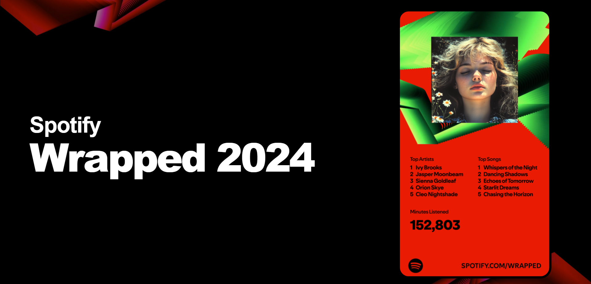

# Spotify Wrapped 2024 Clone



A beautiful clone of Spotify Wrapped 2024 landing page built with Astro and Tailwind CSS 4. Check out the [live demo](https://astro-spotify-wrapped.vercel.app/).

## 🚀 Features

- Built with Astro and TailwindCSS 4
- Fully responsive design
- Beautiful gradient animations
- Optimized for performance
- TypeScript support

## 🛠️ Tech Stack

- [Astro](https://astro.build)
- [TailwindCSS](https://tailwindcss.com)
- [TypeScript](https://www.typescriptlang.org)

## 📦 Getting Started

### Prerequisites

- Node.js 18 or higher
- pnpm (recommended) or npm

### Installation

1. Clone the repository:
```bash
git clone https://github.com/anibalalpizar/astro-spotify-wrapped.git
```

2. Navigate to the project directory:
```bash
cd astro-spotify-wrapped
```

3. Install dependencies:
```bash
pnpm install
```

4. Start the development server:
```bash
pnpm dev
```

The site will be available at `http://localhost:4321`

## 🏗️ Building for Production

To create a production build:

```bash
pnpm build
```

To preview the production build:

```bash
pnpm preview
```

## 🎨 Design Credits

This project is based on the Figma design by [@massliharf](https://www.figma.com/@massliharf).
- [Original Figma Design](https://www.figma.com/community/file/1446229242828191725)

## 📄 License

### Code License
This project is licensed under the [MIT License](LICENSE).

### Design License
The design is licensed under [Creative Commons Attribution 4.0 International](https://creativecommons.org/licenses/by/4.0/).

## 🙏 Acknowledgments

- Design by [@massliharf](https://www.figma.com/@massliharf)
- Built with [Astro](https://astro.build)
- Styled with [TailwindCSS](https://tailwindcss.com)